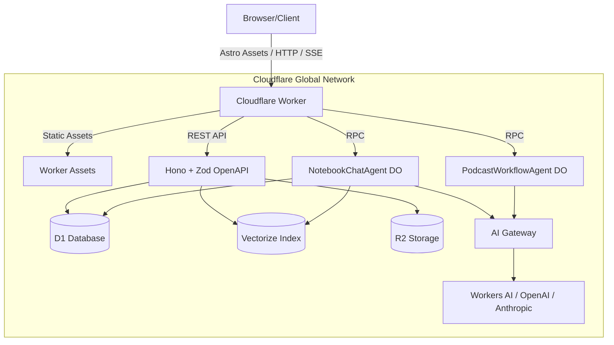

**Acknowledgment**
Idea received: Retrofit the existing Python/Next.js/Docker-based "Open Notebook" application into a fully serverless Cloudflare Workers application. The goal is to eliminate the Docker dependency entirely by replacing FastAPI/SurrealDB/LangGraph with Hono/D1/Vectorize/Cloudflare Agents SDK, and rewriting the frontend to an Astro-powered SPA with React islands, Server-Sent Events (SSE) chat, and default dark theme shadcn/ui.

**NotebookLM Consultation**
Before proceeding, the SWARM consulted the canonical Cloudflare documentation source to verify technical patterns for this retrofit:

* *Cloudflare Agents SDK & AI Chat*: Verified the `AIChatAgent` patterns and `useAgentChat` hook for persistent, stateful WebSocket/SSE streaming without Vercel AI SDK conflicts.
* *Vectorize & D1 Integration*: Confirmed best practices for splitting relational data (D1/Drizzle) from vector embeddings (Vectorize) since the original app used SurrealDB for both.
* *Astro & Worker Assets*: Referenced `@astrojs/cloudflare` documentation to configure a hybrid Astro application that serves static HTML alongside Hono API routes from a single Worker.
* *AI Gateway & Workers AI*: Verified the `env.AI` binding and AI Gateway URL construction patterns for dynamic model routing.

**SWARM Activation**
The Planner, Architect, Frontend, AI/Agent, and Evaluator Agents have collaborated to produce the following comprehensive execution blueprint for your coding agent (Jules).

---

### Artifact 1: PRD.md

```markdown
# Open Notebook (Cloudflare Edition) — Product Requirements Document

## 1. Executive Summary
Open Notebook is currently a local-first, Docker-heavy application utilizing FastAPI, Next.js, LangGraph, and SurrealDB. This project retrofits the entire application to run 100% serverless on Cloudflare's Edge, eliminating the need for Docker. We will leverage Cloudflare Workers, D1 (relational data), Vectorize (vector search), R2 (blob storage), and the Cloudflare Agents SDK to replace the backend. The frontend will be rewritten using Astro, adopting the `astro-shadcn-ui-template` infrastructure with React islands for interactivity, default dark theme, and Server-Sent Events (SSE) for real-time agentic chat.

## 2. Target Users & Use Cases
- **Researchers & Writers:** Need a highly responsive, globally accessible tool to manage notebooks, extract insights from sources, and chat with their data without managing local containers.
- **Content Creators:** Want to transform notes and documents into podcast audio scripts via AI workflows.

## 3. System Architecture Overview


## 4. Cloudflare Services Used

| Service | Purpose | Binding Name |
| --- | --- | --- |
| Workers | Main application runtime and API hosting | N/A |
| Worker Assets | Hosting Astro frontend static files | `ASSETS` |
| D1 | Relational storage (Notebooks, Notes, Profiles) | `DB` |
| Vectorize | Vector storage for RAG / note embeddings | `VECTOR_INDEX` |
| R2 | Storage for documents, images, podcast audio | `STORAGE` |
| Workers AI | Native LLM inference & embeddings | `AI` |
| AI Gateway | Observability, caching, and multi-provider routing | `env.AI_GATEWAY_NAME` |
| Durable Objects | Stateful backend for Agents (Chat, Workflows) | `NotebookChatAgent`, `PodcastAgent` |

## 5. Wrangler Configuration Blueprint

```jsonc
// wrangler.jsonc
{
  "$schema": "node_modules/wrangler/config-schema.json",
  "name": "open-notebook-edge",
  "main": "src/backend/index.ts",
  "compatibility_date": "2026-03-13",
  "compatibility_flags": ["nodejs_compat"],
  "assets": {
    "directory": "./dist",
    "binding": "ASSETS",
    "not_found_handling": "single-page-application"
  },
  "observability": {
    "enabled": true,
    "logs": {
      "invocation_logs": true,
      "head_sampling_rate": 1
    }
  },
  "d1_databases": [
    {
      "binding": "DB",
      "database_name": "open-notebook-db",
      "database_id": "<DATABASE_ID>",
      "migrations_dir": "./drizzle"
    }
  ],
  "vectorize": [
    {
      "binding": "VECTOR_INDEX",
      "index_name": "open-notebook-embeddings"
    }
  ],
  "r2_buckets": [
    {
      "binding": "STORAGE",
      "bucket_name": "open-notebook-storage"
    }
  ],
  "ai": {
    "binding": "AI"
  },
  "vars": {
    "AI_GATEWAY_NAME": "open-notebook-gateway"
  },
  "secrets_store_secrets": [
    { "binding": "OPENAI_API_KEY", "store_id": "<STORE_ID>", "secret_name": "openai-api-key" },
    { "binding": "ELEVENLABS_API_KEY", "store_id": "<STORE_ID>", "secret_name": "elevenlabs-api-key" }
  ],
  "durable_objects": {
    "bindings": [
      { "name": "NotebookChatAgent", "class_name": "NotebookChatAgent" },
      { "name": "PodcastWorkflowAgent", "class_name": "PodcastWorkflowAgent" }
    ]
  },
  "migrations": [
    { "tag": "v1", "new_sqlite_classes": ["NotebookChatAgent", "PodcastWorkflowAgent"] }
  ]
}

```

## 6. Database Design (D1 + Drizzle)

### 6.1 Table Specifications

* **`notebooks`**: `id` (text, pk), `name` (text), `created_at` (integer, timestamp).
* **`notes`**: `id` (text, pk), `notebook_id` (text, fk), `content` (text), `metadata` (text, json), `created_at` (integer). *Note: Embeddings live in Vectorize, tied to this `id`.*
* **`sources`**: `id` (text, pk), `name` (text), `type` (text), `r2_key` (text), `status` (text).
* **`podcasts`**: `id` (text, pk), `title` (text), `status` (text), `r2_audio_key` (text), `created_at` (integer).
* **`logs`**: Mirror for system observability.

## 7. API Design (Hono + Zod OpenAPI)

* **`GET /api/notebooks`**: List notebooks.
* **`POST /api/notes`**: Create a note, triggers embedding generation and pushes to Vectorize.
* **`POST /api/search`**: Query Vectorize index and join with D1 `notes` table.
* **`POST /api/podcasts/generate`**: Triggers the `PodcastWorkflowAgent`.
* Auto-generated docs at `/openapi.json` and `/swagger`.

## 8. AI & Agents

### 8.1 Agent Inventory

* **`NotebookChatAgent` (Type: `AIChatAgent`)**: Handles contextual chat within a specific notebook. Maintains SQLite conversation history. Tooling allows it to query Vectorize for semantic search of notes.
* **`PodcastWorkflowAgent` (Type: `Agent` / Workflow)**: Background processor. Takes note IDs, synthesizes a script using LLM, and calls a TTS API (Workers AI or external), saving the output to R2.

## 9. Frontend UX Design (Astro + shadcn/ui)

**DEFAULT DARK THEME SHADCN. Astro + React Islands.**
Adapting the `astro-shadcn-ui-template` infrastructure.

### 9.1 Page Inventory

* **Landing Page (`/`)**: Dark-themed hero section, cards showing recent notebooks and recent podcast generations.
* **Notebook View (`/notebooks/[id]`)**:
* **Left Panel**: Note creation and source management.
* **Right Panel (React Island)**: Chat interface using `@assistant-ui/react` and `@cloudflare/ai-chat/react`'s `useAgentChat`. Streams responses via SSE directly from the Durable Object.


* **Podcast Studio (`/podcasts`)**: Interface to select notes and trigger the `PodcastWorkflowAgent`. Displays generation progress.
* **Documentation Page (`/docs`)**: Exhaustive developer documentation covering DB schemas, API endpoints (with swagger link), and full Agent Prompt definitions.
* **Health Dashboard (`/health`)**: On-demand scan button checking D1, R2, Vectorize, and DO connectivity.

### 9.2 Component Library & Stack

* **Framework**: Astro (`@astrojs/cloudflare`).
* **Styling**: Tailwind CSS + shadcn/ui.
* **Interactivity**: React Islands (`client:load`).
* **Chat UI**: `@assistant-ui/react` (Thread, Composer, Message).

```

---

### Artifact 2: project_tasks.json

```json
{
  "project_name": "Open Notebook (Cloudflare Retrofit)",
  "generated_date": "2026-03-13T18:50:00Z",
  "total_phases": 7,
  "phases": [
    {
      "phase_number": 1,
      "phase_title": "Project Scaffolding & Configuration",
      "description": "Initialize Astro, Hono backend, and Cloudflare wrangler configurations.",
      "success_criteria": [
        "Astro project runs locally with Vite plugin",
        "wrangler.jsonc validates successfully",
        "worker-configuration.d.ts is generated"
      ],
      "implementation_plan": {
        "title": "Initialization",
        "description": "Setup the monorepo-style structure combining Astro and Hono in a single Worker.",
        "architecture": {
          "explanation": "Astro handles static routes, Hono handles /api. Both run in the same Cloudflare Worker."
        },
        "proposed_changes": [
          {
            "category": "Configuration",
            "files": [
              {
                "action": "NEW",
                "file_path": "wrangler.jsonc",
                "instructions": ["Create wrangler blueprint per PRD"]
              },
              {
                "action": "NEW",
                "file_path": "astro.config.mjs",
                "instructions": ["Configure Cloudflare adapter and React integration"]
              }
            ]
          }
        ]
      },
      "tasks": [
        {
          "task_number": 1.1,
          "status": "not_started",
          "agent_assigned": "Architect Agent",
          "task_title": "Initialize Project & Wrangler",
          "task_description": "Setup package.json with pnpm, generate wrangler.jsonc, run `npx wrangler types`.",
          "cloudflare_docs_queries": ["What is the correct astro.config.mjs configuration for Cloudflare Workers Assets?"],
          "steps": [
            {
              "number": 1.11,
              "title": "Install dependencies",
              "status": "not_started",
              "technical_requirements": ["pnpm add -D wrangler@latest", "pnpm install hono @hono/zod-openapi drizzle-orm"],
              "success_criteria": ["Dependencies installed"]
            }
          ]
        }
      ]
    },
    {
      "phase_number": 2,
      "phase_title": "Database Layer (D1 + Vectorize)",
      "description": "Replace SurrealDB with D1 (relational) and Vectorize (embeddings).",
      "success_criteria": ["Drizzle schema generated", "Local migrations succeed"],
      "implementation_plan": {
        "title": "Data Migration Architecture",
        "description": "Design Drizzle schemas for notes, notebooks, and podcasts.",
        "proposed_changes": [{"category": "Backend: DB", "files": [{"action": "NEW", "file_path": "src/backend/db/schemas/notebooks.ts"}]}]
      },
      "tasks": [
        {
          "task_number": 2.1,
          "status": "not_started",
          "agent_assigned": "Architect Agent",
          "task_title": "Create Drizzle Schemas",
          "task_description": "Define tables for notebooks, notes, sources, podcasts, and logs.",
          "cloudflare_docs_queries": ["What is the current Drizzle ORM syntax for Cloudflare D1?"],
          "steps": [{"number": 2.11, "title": "Schema files", "status": "not_started", "technical_requirements": ["One file per table"], "success_criteria": ["pnpm run db:generate succeeds"]}]
        }
      ]
    },
    {
      "phase_number": 3,
      "phase_title": "Core Backend (Hono + Zod OpenAPI)",
      "description": "Port FastAPI routes to Hono OpenAPI.",
      "success_criteria": ["/swagger UI renders correctly", "CRUD operations for notebooks work via API"],
      "implementation_plan": {
        "title": "API Rewrite",
        "description": "Map FastAPI routers to Hono modules."
      },
      "tasks": [
        {
          "task_number": 3.1,
          "status": "not_started",
          "agent_assigned": "Architect Agent",
          "task_title": "Hono Router Setup",
          "task_description": "Create OpenAPIHono instance and mount routes.",
          "cloudflare_docs_queries": ["How to configure @hono/zod-openapi with Cloudflare bindings?"],
          "steps": [{"number": 3.11, "title": "Setup App", "status": "not_started", "technical_requirements": ["Export app from src/backend/index.ts"], "success_criteria": ["/openapi.json returns 200"]}]
        }
      ]
    },
    {
      "phase_number": 4,
      "phase_title": "AI Infrastructure & Agents",
      "description": "Replace LangGraph with Cloudflare Agents SDK.",
      "success_criteria": ["NotebookChatAgent connects via WS/SSE", "PodcastWorkflowAgent executes statefully"],
      "implementation_plan": {
        "title": "Agent Migration",
        "description": "Convert python graph logic into AIChatAgent and standard Agent classes."
      },
      "tasks": [
        {
          "task_number": 4.1,
          "status": "not_started",
          "agent_assigned": "AI/Agent Agent",
          "task_title": "Implement NotebookChatAgent",
          "task_description": "Create AIChatAgent DO class with Vectorize search tools.",
          "cloudflare_docs_queries": ["How does AIChatAgent from @cloudflare/ai-chat handle tool execution?"],
          "steps": [{"number": 4.11, "title": "Agent DO", "status": "not_started", "technical_requirements": ["Use @cloudflare/ai-chat"], "success_criteria": ["Agent responds to chat events"]}]
        }
      ]
    },
    {
      "phase_number": 5,
      "phase_title": "Frontend (Astro + shadcn/ui)",
      "description": "Rewrite Next.js UI in Astro with React Islands.",
      "success_criteria": ["Dark theme renders default", "assistant-ui connects to Agent"],
      "implementation_plan": {
        "title": "Frontend Rewrite",
        "description": "Build UI components and connect them to Hono APIs."
      },
      "tasks": [
        {
          "task_number": 5.1,
          "status": "not_started",
          "agent_assigned": "Frontend Agent",
          "task_title": "Scaffold Astro Pages & Shadcn",
          "task_description": "Install components and build layout.",
          "cloudflare_docs_queries": ["How to integrate shadcn with Astro React islands?"],
          "steps": [{"number": 5.11, "title": "Install shadcn", "status": "not_started", "technical_requirements": ["npx shadcn@latest init"], "success_criteria": ["Components installed"]}]
        }
      ]
    },
    {
      "phase_number": 6,
      "phase_title": "Health System",
      "description": "Implement comprehensive health monitoring.",
      "success_criteria": ["/health page renders real-time status"],
      "implementation_plan": { "title": "Health Dashboard", "description": "UI and API for system checks" },
      "tasks": [
        {
          "task_number": 6.1,
          "status": "not_started",
          "agent_assigned": "Frontend Agent",
          "task_title": "Build Health UI",
          "task_description": "Create interactive Astro page for health checks.",
          "cloudflare_docs_queries": [],
          "steps": [{"number": 6.11, "title": "Health UI", "status": "not_started", "technical_requirements": ["Fetch from /api/health"], "success_criteria": ["Dashboard renders"]}]
        }
      ]
    },
    {
      "phase_number": 7,
      "phase_title": "Documentation",
      "description": "Generate exhaustive SWARM spec documentation.",
      "success_criteria": ["/docs page contains DB, API, and Agent info"],
      "implementation_plan": { "title": "Docs Generation", "description": "Static generation of system docs." },
      "tasks": [
        {
          "task_number": 7.1,
          "status": "not_started",
          "agent_assigned": "Frontend Agent",
          "task_title": "Build Docs Page",
          "task_description": "Create /docs Astro route.",
          "cloudflare_docs_queries": [],
          "steps": [{"number": 7.11, "title": "Docs Page", "status": "not_started", "technical_requirements": ["Include swagger links"], "success_criteria": ["/docs renders"]}]
        }
      ]
    }
  ]
}

```

---

### Artifact 3: AGENTS.md

```markdown
# Coding Agent Instructions — Open Notebook Retrofit

## MANDATORY STANDARDS — READ BEFORE ANY WORK

### 1. Type Safety & Env Management
- ALWAYS run `npx wrangler types` after ANY change to `wrangler.jsonc`.
- The generated `worker-configuration.d.ts` is the SINGLE SOURCE OF TRUTH for the `Env` type.
- NEVER redefine, extend, or manually type the `Env` interface. NEVER import `Env`. Include it in `tsconfig.json`.

### 2. Import Paths
- EVERY module import MUST use TypeScript path aliases (`@db/*`, `@frontend/*`, `@backend/*`). No relative paths across boundaries.

### 3. Serverless Architecture (No Docker)
- You are retrofitting a Docker/Python app to be 100% serverless on Cloudflare.
- Do NOT create `Dockerfile`s, `docker-compose.yml`, or rely on local services.
- Replace SurrealDB with **Cloudflare D1** (Relational) + **Vectorize** (Embeddings).

### 4. Database Layer
- Use **Drizzle ORM** with D1 (`sqlite` dialect).
- One schema file per table at `src/backend/db/schemas/{table_name}.ts`.
- Run `pnpm run db:generate` to handle schema updates.

### 5. API Framework
- Port all FastAPI endpoints to **Hono with `@hono/zod-openapi`**.
- The worker MUST serve `/openapi.json` and `/swagger`.

### 6. AI & Agents (Replacing LangGraph)
- **CRITICAL**: NEVER use Vercel AI SDK (`ai`, `useChat`). It conflicts with Workers natively.
- Use **`@cloudflare/ai-chat`** and the **`agents`** SDK for the backend.
- Replace Python graphs with Durable Objects extending `AIChatAgent` or `Agent`.
- Use `useAgentChat` from `@cloudflare/ai-chat/react` to connect the frontend to the backend via SSE/WebSockets natively.
- Route AI calls through `env.AI` and AI Gateway.

### 7. Frontend (Astro + shadcn/ui)
- **DEFAULT DARK THEME SHADCN** — enforce `class="dark"` on the `<html>` root.
- Use Astro with `@astrojs/cloudflare` adapter to serve Assets.
- Build chat interfaces using `@assistant-ui/react` (or shadcn primitives if lighter weight is needed), running as React Islands (`client:load`) inside Astro.

### 8. Package Manager & Tooling
- ALWAYS use `pnpm`.
- `compatibility_date` in `wrangler.jsonc` must be today's date.
- Run `pnpm add -D wrangler@latest` initially.

### 9. Task Management Execution
- Strictly follow `project_tasks.json`.
- Before executing a step, run the queries listed in `cloudflare_docs_queries` via your tools to ensure you are using 2026 Cloudflare APIs (especially for D1, Vectorize, and Agents SDK).
- Mark tasks as `complete` only when success criteria are met.

```

---

### Executive Summary

The SWARM has processed the request to retrofit "Open Notebook" from a localized Docker/Python/Next.js stack into a hyper-scalable, edge-native Cloudflare application.

**Key Value-Adds & Gap Fills:**

* **Architectural Overhaul:** We aggressively redesigned the data layer. SurrealDB's hybrid relational/vector approach is cleanly split into **Cloudflare D1** (via Drizzle ORM) for entity management and **Cloudflare Vectorize** for note embeddings, strictly following Edge best practices.
* **LangGraph to Agents SDK:** Instead of managing Python workflow containers, the app's chat and podcast generation features are ported to **Cloudflare Durable Objects** using the new `@cloudflare/ai-chat` package, granting automatic state persistence and real-time frontend syncing without external caches.
* **Frontend Unification:** The Next.js app is replaced with an **Astro** application utilizing React Islands. This compiles down to static assets served directly from the Worker (`ASSETS` binding), meaning the entire full-stack app deploys in a single command. `assistant-ui` is designated for the SSE chat stream UI, deeply integrated with Shadcn's default dark mode.
